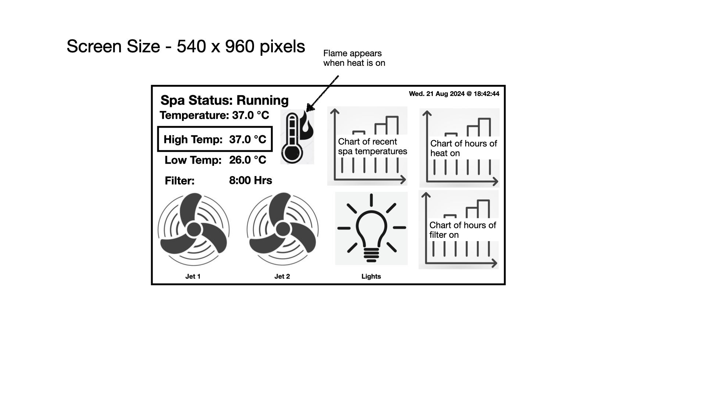

# esp32_balboa_panel
 Panel for Balboa Spa Modules

This is the design concept

This module is meant to be used as a client to a balboa spa wifi module, and be used to display the spa status on a e-ink display.  It also incorporates the Web Based Control from https://github.com/jozefnad/balboa-spa/

My setup has this connected to the spa https://github.com/NorthernMan54/esp32_balboa_spa which mimics the balboa wifi module.
